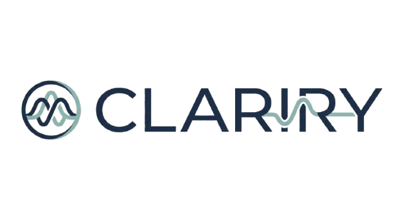

<p align="center">
  
</p>

<p align="center">
  
</p>

<h2 align="center">🎧 An Offline Audio-First Learning Engine for Deep Conceptual Mastery</h2>

---

<p align="center">
  
  
  
  
  
</p>

---

## 🚀 CLARIRY

> *Clarity first. Marks as a consequence.*

**CLARIRY** is an offline, system-controlled, paragraph-level AI learning engine designed for serious students who want conceptual understanding — not surface-level summaries.

It transforms long, text-heavy PDFs into structured, interruptible, audio explanations.

Not a chatbot.
Not a summarizer.
A disciplined learning system.

Built by **Ishaan Ray (Cipher Shadow IR)** 🧠

---

## 🌌 The Problem

Most students face:

* 📚 100+ page PDFs
* 😵 Text overload
* 🧠 Memorization without understanding
* ❌ Poor exam recall

Chatbots distract.
Summarizers oversimplify.
Reading encourages skipping.

Understanding suffers.

---

## 💡 The CLARIRY Solution

CLARIRY enforces structured comprehension:

* 🔊 Explains **one paragraph at a time**
* 🧩 Each paragraph is an independent atomic unit
* 🛑 Allows real-time interruption
* 🔁 Supports non-linear jumps
* 🧠 Converts understanding into exam-ready format

It simulates disciplined teaching — not casual chatting.

---

## 🎯 What It Does

### 📄 PDF-Centric Learning

* Upload digitally typed PDFs (100–200 pages supported)
* Automatic paragraph indexing
* Active paragraph highlighting
* Click-to-explain navigation

### 🎧 Audio-First Explanation

* Conversational tone
* Example-driven
* Short & focused
* No textbook verbosity

### 🔁 Random Access

* Jump to any paragraph
* Re-explain without penalty
* Resume from exact break-point

### 🧠 Exam Mode

* Converts content into:

  * Bullet points
  * Keywords
  * Formal tone
  * Answer-ready structure

---

## 🏗 System Architecture

```
Desktop UI (Python)
│
├── PDF Viewer + Highlighting
├── Playback Controls
│
▼
Core Engine
│
├── Paragraph Indexing
├── Navigation State
├── Interrupt Logic
│
▼
Offline AI Layer
│
├── Local LLM (Stateless)
├── Offline TTS
```

🧠 The LLM has no memory.
📦 All state is system-managed.

That design prevents hallucinated context and preserves deterministic learning flow.

---

## 🧩 Tech Stack

| Layer              | Technology             |
| ------------------ | ---------------------- |
| **Core Engine**    | Python                 |
| **Desktop UI**     | PySide / PyQt          |
| **PDF Processing** | PyMuPDF / pdfplumber   |
| **LLM Execution**  | llama.cpp / Ollama     |
| **TTS**            | Coqui TTS / System TTS |
| **State Storage**  | JSON → SQLite (future) |

---

## 🌐 Landing Page

CLARIRY includes a premium HTML/CSS/JS landing page inside:

```
web-html/
```

Features:

* ⚡ Glitch Preloader
* 🌌 Cosmic Parallax UI
* 🪞 Glassmorphism
* 🎨 No build tools required

Open `index.html` to experience.

---

## 🧠 How It Works

1. Open PDF
2. System indexes paragraphs
3. User clicks paragraph
4. LLM explains
5. TTS speaks
6. User can interrupt
7. System resumes cleanly

Flow is deterministic.
AI is stateless.
System controls everything.

---

## 🔭 Roadmap

* 🎯 Doubt context tracking
* 🧠 Improved resume logic
* ⚡ Performance optimization
* 🧩 SQLite state engine
* 🎛 Keyboard-first navigation
* 📊 Learning analytics (future vision)

---

## ⚙️ Local Setup (Desktop)

```bash
# Clone repository
git clone https://github.com/Cipher-Shadow-IR/clariry.git

# Enter directory
cd clariry

# Install dependencies
pip install -r requirements.txt

# Run app
python main.py
```

---

## 💬 Author

<p align="center">
  <br><br>
  <b>Built by Ishaan Ray (Cipher Shadow IR)</b><br>
  <i>“Understanding, one paragraph at a time.”</i><br><br>
  <a href="https://github.com/Cipher-Shadow-IR" target="_blank">
    
  </a>
</p>
